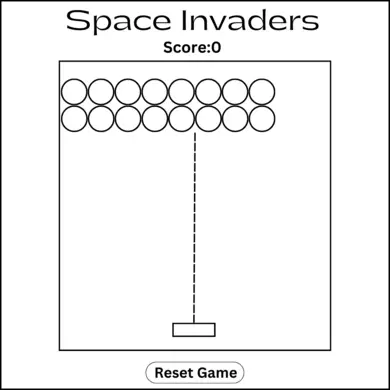
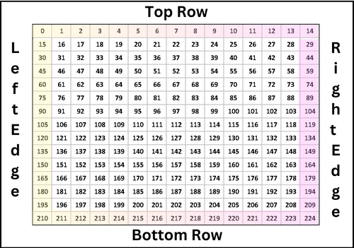
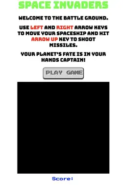
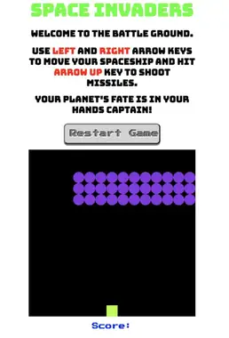
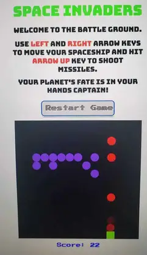
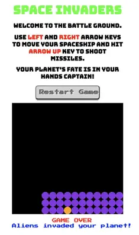
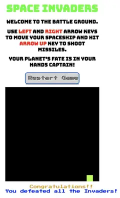

# 👾 Space Invaders Game 👾

A classic arcade game that takes you down memory lane! Click [here](maviakazi.github.io/Space-Invaders/) to play the game and challenge your skills.

### ✏ Wire Frame

A simple prototype of the game that I created before writing any code. My initial goal was to achieve the functionality and add styling after.

#### 🔲 Game Board Visualisation

The game board contains total 225 squares divs (15 by 15). The aliens start from the top and the player is at the bottom row.

### 🎮 Final Game Screenshots

🎯 Initial Screen when page loads:

    

🎯 When "Play Game" button is clicked:

    

🎯 When player shoots the missles:

    

🎯 When game is lost

    

🎯 When game is won

    

### ⚙️ Technologies Used

-   HTML
-   CSS
-   JavaScript
-   DOM Manipulation

### 🏁 Getting Started

Check out the final version of [Space Invaders Game](maviakazi.github.io/Space-Invaders/).

Use Right and Left Arrow Keys to move your spaceship and Arrow-Up key to shoot missiles.

### 😔 Challenges Faced

-   Make the missiles travel from shooter to the invader
-   Determine the left and the right edges of the board using modulus operator
-   No able to bring the top row of invaders all the way down

### 🚀 Next Steps

Features that can be added in future:

-   Use images of spaceship and aliens instead of square and circles
-   Make aliens shoot back
-   Add more levels
-   Add game start and game over screens
